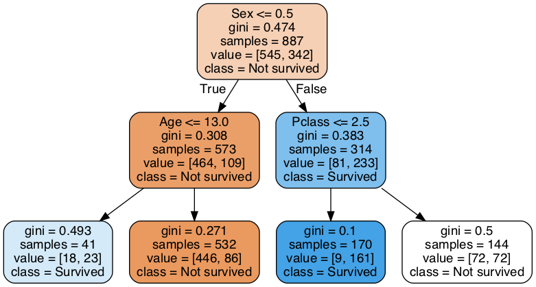
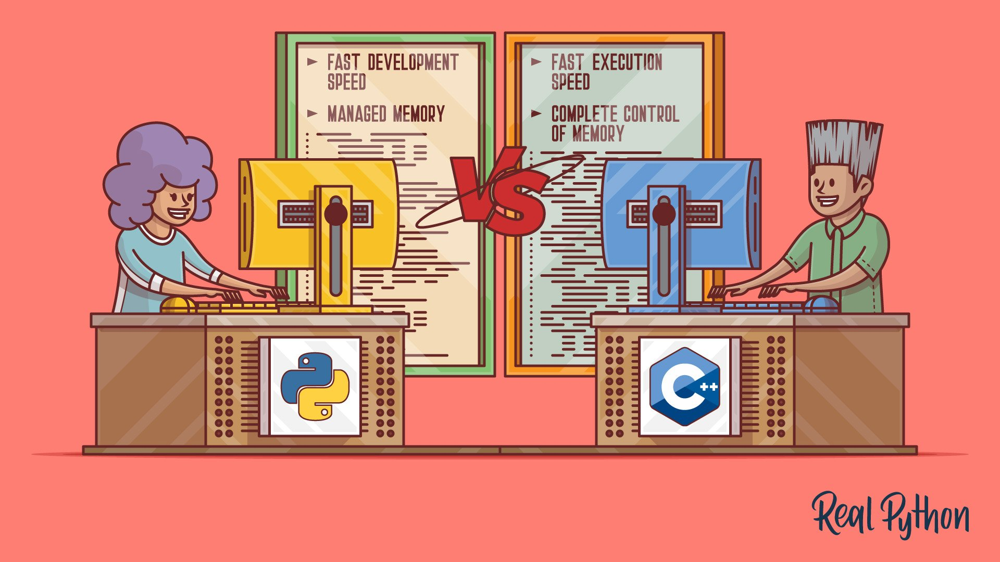
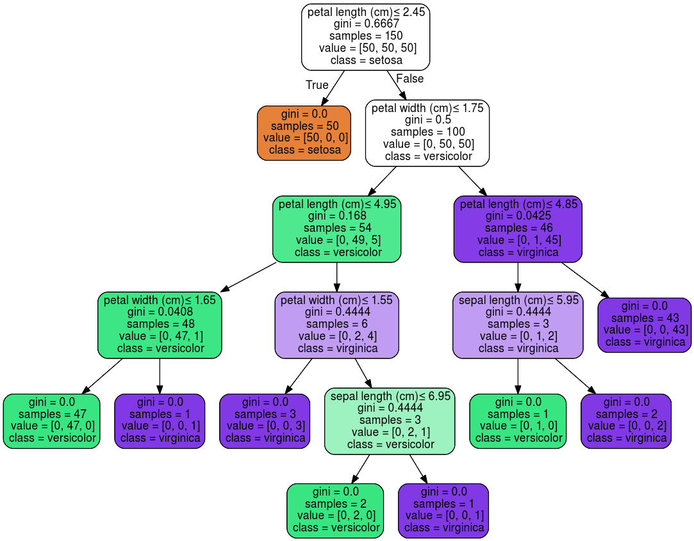
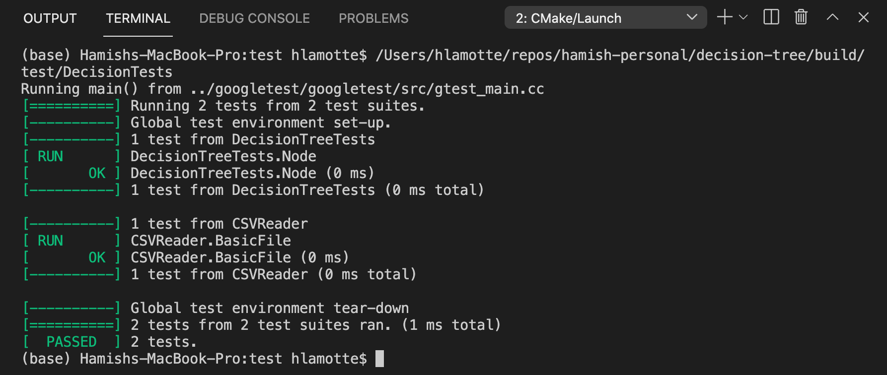
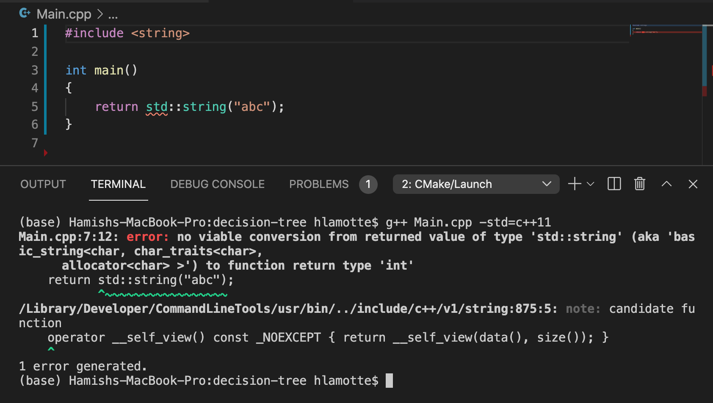
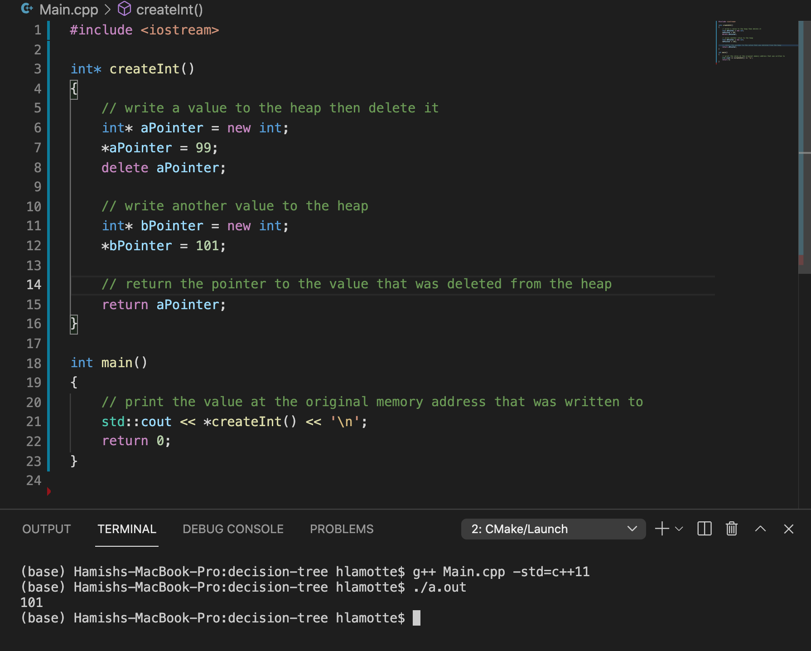
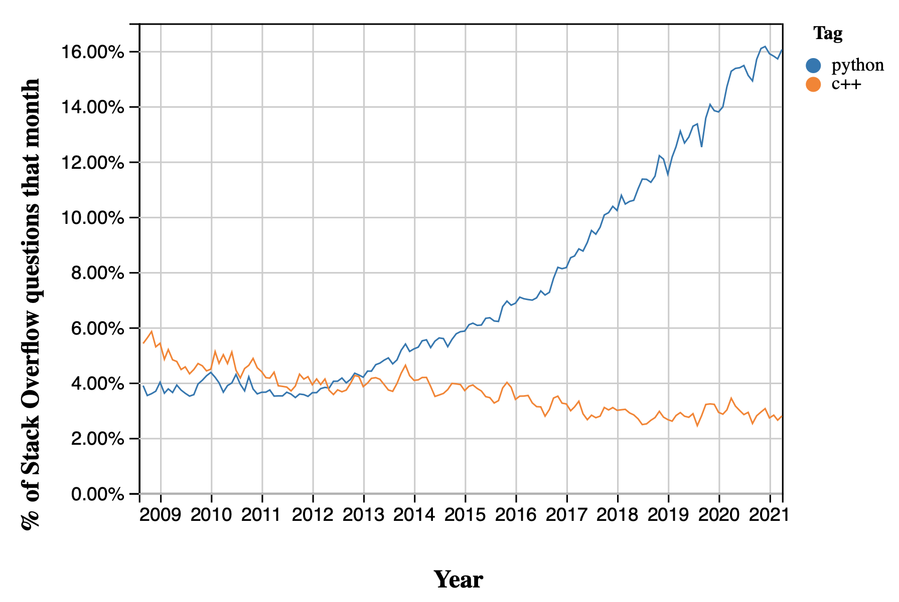
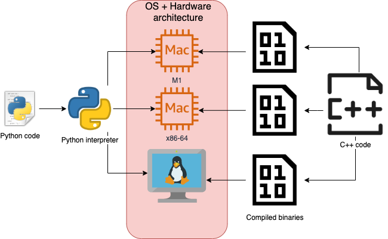

# Decision Tree
### From scratch in C++, wrapped for Python

Hamish Lamotte
*August 2021*

---
# Agenda
1. Motivation
2. What is a decision tree?
3. Key learnings
4. Demo using real data
5. Conclusions


---
## Motivation

- Gain a deeper understanding of programming
  - What is abstracted away in Python?
  - What are the trade-offs when choosing a language?




---
## Motivation

- Understand a simple but powerful machine learning algorithm
- A representative use-case for using something faster than Python


---
## What is a decision tree?

<style scoped>
table {
    height: 3%;
    font-size: 15px;
}
</style>

|PassengerId|Pclass|Name                            |Sex   |Age |SibSp|Parch|Ticket|Fare  |Cabin|Embarked|
|-----------|------|--------------------------------|------|----|-----|-----|------|------|-----|--------|
|892        |3     |Kelly, Mr. James                |male  |34.5|0    |0    |330911|7.8292|     |Q       |
|893        |3     |Wilkes, Mrs. James (Ellen Needs)|female|47  |1    |0    |363272|7     |     |S       |


---

### Steps to build a decision tree

1. For each of the features evaluate the resulting split.
2. Split your dataset based on the feature that gave the "best" split.
3. Repeat steps above on resulting sub-datasets until only one outcome class left at each branch end.


---
### Building and making predictions

<style scoped>
table {
    height: 3%;
    font-size: 15px;
}
</style>


|Id |SepalLengthCm|SepalWidthCm|PetalLengthCm|PetalWidthCm|Species    |
|---|-------------|------------|-------------|------------|-----------|
|1  |5.1          |3.5         |1.4          |0.2         |Iris-setosa|
|51 |7.0          |3.2         |4.7          |1.4         |Iris-versicolor|



---

## Project objective
- Implement decision tree
- Restrict scope
   - Categorical features and outcome classes only
   - Features classes integer encoded from zero
   - Provide training and test data as CSV
   - Gini impurity metric to evaluate split
 - Learn data structures and memory management
   - Implement own data structures


---

## Key learnings
1. Make good architectural decisions early
1. Writing tests will save you in the long run
3. C++ requires a different mental model
4. The online community of a language is worth a lot
5. Portability is an important consideration


---
### Consider architecture early
- Node
  - Attributes
    - Children nodes (pointers)
    - Data
    - Best split feature
    - Best split category
  - Methods
    - Calculate best split feature and category


---
### Consider architecture early
- Tree
  - Attributes
    - Root node of tree
  - Methods
    - Read CSV
    - Construct tree
    - Split data
    - Predict


---
### Consider architecture early
```bash
.
├── CMakeLists.txt
├── CSVReader.cpp
├── CSVReader.hpp
├── DecisionTree.cpp
├── DecisionTree.hpp
├── Main.cpp
├── Node.cpp
├── Node.hpp
└── README.md
```


---
### Write tests
```python
# python testing example
def increment(x):
    return x + 1

def test_answer():
    assert increment(3) == 4
```
Writing testable code gives confidence that:
- it does what we intended
- a change hasn't broken everything.

A more robust choice than `print` statements...

---
### Testing in C++
Google test + CMake (for building) worked well.



---
### C++ requires a different mental model
C++ is compiled: 
C++ code -> CPU instructions upfront



---
### C++ requires a different mental model
You have control of memory management - can be dangerous if you're not careful.



---
### Online community is worth a lot


---
### Portability is an important consideration



---
#### Calling compiled C++ program from Python
1. Can it predict whether they survived on Titanic?
2. Open source decision tree comparison

Demo time


---
# Conclusions
1. Choose the right tool for the job.
2. Memory management is hidden in Python, but packages with compiled dependencies like Pandas have their own memory management.
3. C++ has a steep learning curve and a vast feature set.

Time to explore Go and Rust...


